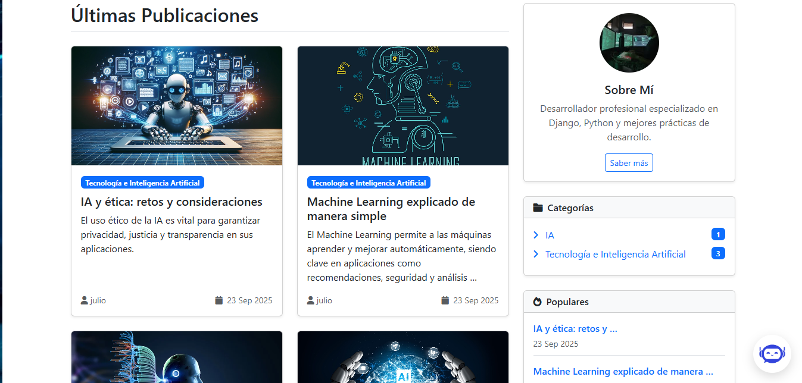
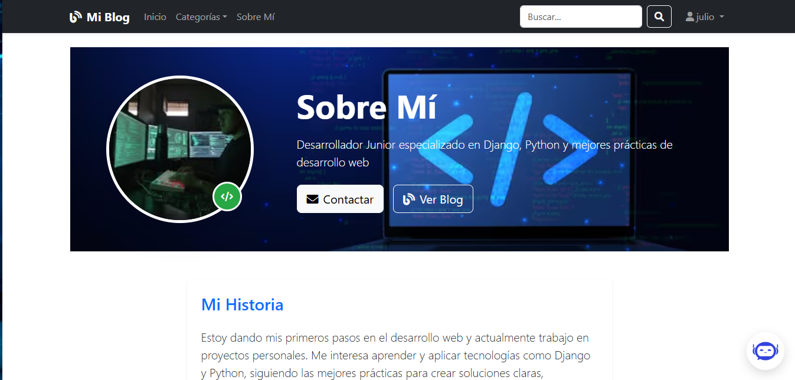
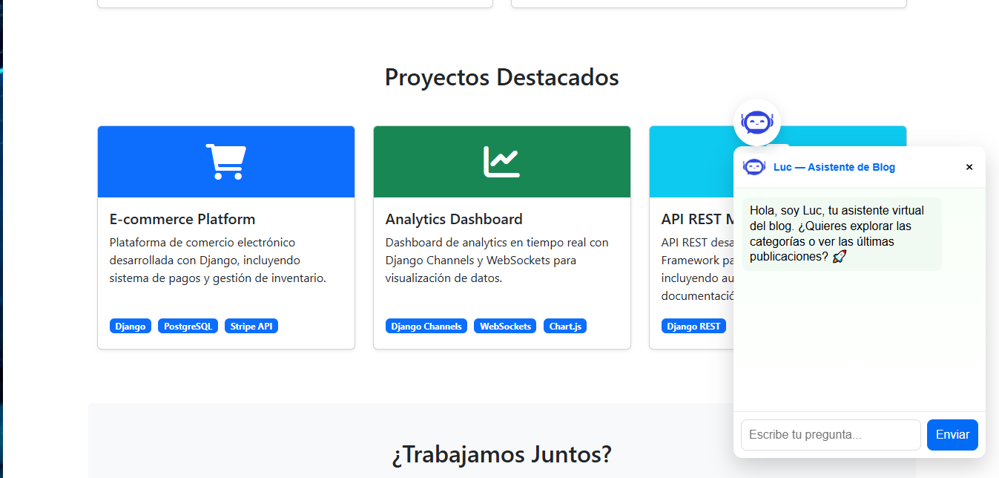
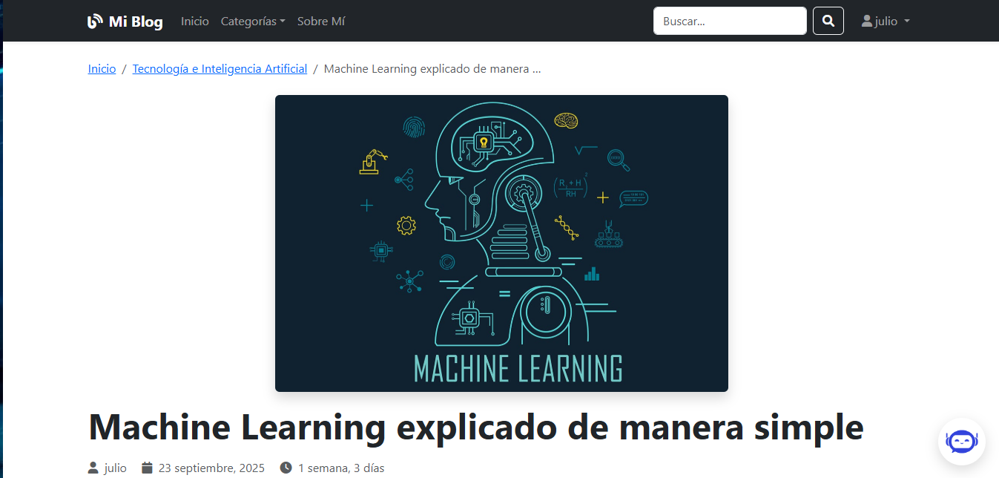

# 📝 Blog Personal - Publicación de Artículos  


---

## 📌 Descripción  

Este es un **blog personal** desarrollado con **Django 4.2** y **MySQL** como base de datos.  
El sistema permite publicar artículos, administrarlos desde un panel de control, añadir contenido enriquecido con **CKEditor**, y organizarlos mediante **tags**.  

El diseño se realizó con **Bootstrap 5 (crispy-bootstrap5)** y estilos personalizados en CSS, además de funcionalidades dinámicas con **JavaScript**.  

---

## 🚀 Tecnologías utilizadas  

- **Backend:** Django 4.2 (Python)  
- **Base de datos:** MySQL  
- **Frontend:** HTML5, CSS3, JavaScript, Bootstrap 5  
- **Dependencias clave:**  
  - `mysqlclient` → Conexión a MySQL  
  - `Pillow` → Manejo de imágenes  
  - `django-ckeditor` → Editor de texto enriquecido  
  - `django-taggit` → Etiquetas para artículos  
  - `django-crispy-forms` + `crispy-bootstrap5` → Formularios estilizados con Bootstrap 5  
  - `python-decouple` + `python-dotenv` → Manejo seguro de variables de entorno  
  - `django-autoslug` → Generación automática de slugs  
  - `google-generativeai` → Integración de IA para generación de contenido  

---

## ⚙️ Funcionalidades  

✅ Publicación de artículos con contenido enriquecido (texto + imágenes)  
✅ Categorías y etiquetas dinámicas con `django-taggit`  
✅ CRUD completo desde el panel de administración  
✅ Editor avanzado con `django-ckeditor`  
✅ Formularios responsivos con `crispy-bootstrap5`  
✅ Manejo de slugs automáticos para URLs amigables  
✅ Configuración segura con `.env` usando `python-decouple`  
✅ Integración de IA con **Google Generative AI** para asistencia en redacción  

---

## 🛠️ Instalación y configuración  

1. Clonar el repositorio:  
   ```bash
   git clone https://github.com/tuusuario/blog-personal.git
   cd blog-personal
   ```
2. Crear y activar entorno virtual:
   ```bash
   python -m venv venv
   source venv/bin/activate  # Linux/Mac
   venv\Scripts\activate     # Windows
   ```
3. Instalar dependencias:
   ```bash
   pip install -r requirements.txt
   ```
4. Configurar la base de datos MySQL en settings.py:
   ```bash
   DATABASES = {
        'default': {
            'ENGINE': 'django.db.backends.mysql',
            'NAME': 'blog_db',
            'USER': 'tu_usuario',
            'PASSWORD': 'tu_password',
            'HOST': 'localhost',
            'PORT': '3306',
        }
    }
   ```
5. Crear archivo .env en la raíz del proyecto con tus variables de entorno:
   ```bash
    DEBUG=True
    SECRET_KEY=tu_clave_secreta
    DB_NAME=blog_db
    DB_USER=tu_usuario
    DB_PASSWORD=tu_password
    DB_HOST=localhost
    DB_PORT=3306
    GOOGLE_API_KEY=tu_api_key
    ```
6. Migrar la base de datos:
  ```bash
  python manage.py migrate
  ```
7. Crear superusuario:
  ```bash
  python manage.py createsuperuser
  ```
8. Ejecutar el servidor:
  ```bash
  python manage.py runserver
  ```
9. Abrir en el navegador:
  ```bash
  http://127.0.0.1:8000/
  ```

## 📂 Estructura recomendada del proyecto
```bash
  blog-personal/
  ├── asistente_ia/          # Módulo con integración de IA (Gemini API)
  ├── blog/                  # App principal del blog (templates y static aquí)
  ├── mi_blog/               # Configuración principal del proyecto (settings, urls, wsgi)
  ├── usuario/               # App para administración de usuarios
  ├── requirements.txt       # Dependencias del proyecto
  ├── manage.py              # Punto de entrada de Django
  ├── README.md              # Documentación del proyecto
  └── screenshots/           # Capturas de pantalla
```

## 🖼️ Capturas de pantalla






# 👨‍💻 Autor
**Julio Solano**  
🔗 [GitHub](https://github.com/solanomillo)  
📧 solanomillo144@gmail.com

# 📄 Licencia
Este proyecto está bajo la licencia MIT.
Podés usarlo, compartirlo y modificarlo libremente.
